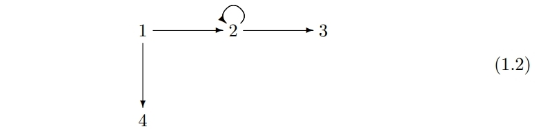

#CategoryTheory #Notes

## Part1.Set 集合

集合是一个数学实体，它和构成它的元素(Elements)不同，但却是由它们所构成的。在这里，我们只需要把它作为一个“数学实体”的概念来理解就行了。

> “实体”这个概念，我愿把它理解为这样一种存在：可以与其他存在发生联系，可以被构成。

我们用$\{\}$ 这个符号表示集合。我们管它叫做*集合构建注记(setbuilder notation)*。在下面的笔记我会简称它为集合注记。

我们通常以这样的形式表达集合：

$\{x|P(x)\}$ 

P(x)表示集合的元素x满足某种条件（或者可以说，满足某种性质），而该集合由所有满足P的元素x组成。

#### 罗素悖论 Russel Paradox

[[罗素悖论]]

使用集合注记时，应注意避免遇到罗素悖论的问题。罗素悖论是由朴素集合论带来的问题：朴素集合论对于集合的定义过于宽泛。[[朴素集合论]]

如此带来了一个严重的悖论问题。举例来讲，便是这样的一个阐述：“存在一个由不包含自身的集合组成的集合”。

考虑这个阐述所表明的：

{S | S is a set and S not belong to S}

假设满足该性质的元素集合记作T，那么对于$T\notin T$,显然会出现这样的问题：

- 如果$T\notin T$ 成立，那么T满足了对应性质P，这意味着$T \in T$ 。

即当我们阐明一个“由不包含自身的集合组成的集合”时，悖论就发生了。

而避免遇到这种悖论问题很简单：当我们使用集合注记时，只要指定了对应的数据类型（都是自然数、有理数etc），便可以避免这样的问题了。

不过请注意，我们之后讨论的集合如前所述，都是**数学实体**。

#### 笛卡尔积 Cartesian Product

这又称直积。

两个集合的笛卡尔积按定义为：

$S\times T =\{(x,y)|x \in S,y \in T\}$

即笛卡尔积为由两个集合中的元素组成的**序偶（Order pairs)** 构成的集合。它是有序的，即:

$S\times T \neq T\times S$

因为此时显然存在序偶$(x,y)\neq (y,x)$。

如上的形式，笛卡尔积可以被理解为空间上的一个点，这也是笛卡尔积的几何表示。

同样，笛卡尔积显然可以被拓展为一个**长度为n的有序元组（ordered n-tuple）**:

$S_{1} \times S_{2} \times S_{3}... \times S_{n} = (s_1,s_2,s_3,...,s_n)$

> 也不知道是谁把tuple翻译为元组的，有说法是tuple应该翻译为多元组，但我更青睐于*序组*这个翻译。

#### 关系 Relation

从集合S到集合T的关系 $\alpha$ ,其实便是集合S与集合T的笛卡尔积的**子集**。即:

$\alpha = G \subseteq S \times T$

一个有用的例子是对角线关系（Diagonal Relationship），它是集合S与集合S的一种关系，即集合S自身的笛卡尔积的子集:

$\triangle_\alpha =\{(x,x)|x \in S\} \subseteq S \times S$

> [[对角关系Diagonal Relation]] 之所以叫对角线关系，是因为若$S=R$ ，那么将它作为图表示时，$S \times S$ 便会是 $y = x$这样的对角线。

另一个例子是“<”（小于）这样定义在实数集上的一种关系，它可以被表示为：

{(r, s) | There is a positive number t such that r + t = s}

即：所有的关系，我们都可以以集合的形式表现or描述

对于一个从集合S到集合T的关系$\alpha$ ，我们通常写作 $s  \alpha  t$ ，它可以被看作为$(s,t)\in \alpha$ 。

>例：
>2<3 --> $(2,3) \in (R,S)$,for 2,3 both in R and exist positive number 1 for 2 to satisfy 2+1=3
>2<3 := $R \alpha R$

> 关于关系，可阅读[[Szekeres数学物理]1.3 Cartesian(笛卡尔)积与关系](https://zhuanlan.zhihu.com/p/572311641)

## Part2.Fuctions 函数

对于函数，我们也将它定义为一个数学实体，记为$f$。它具有以下属性：

- 具有定义域(domain)和陪域(codomain，也被翻译为上域)，它们是两个集合。

> 陪域，即函数可能的取值空间，它不同于值域（range）。值域是陪域的子集。这是在此处范畴论中关于函数和我们高中数学所学不同的地方。
> 
> 关于为什么要有陪域,可从这几个方面去理解：
> 
> 1.函数是数学中一个通用的概念。但在不同的领域中，它所关心的东西也不同，因而我们只需能够通过函数的定义得知“函数的输出会放在哪里即可”。[[Why do we have codomain?]]
> 
> 2.通常情况下，我们不会去关心函数具体的值域，只关心这个函数对应的取值空间即可。（所谓“数学的设定都是源自关心的东西”）。[# 能否废除「陪域」这一概念？
](https://www.zhihu.com/question/526026905/answer/2423602793)

- 对于每个定义域中的元素x，总是有一个陪域中的元素和它对应，我们将它标记为$f(x)$。
- 如果一个函数被指定了的话，那么此时，定义域、陪域等都已完全由由函数决定。
  
> 这一点的意思是说，函数是一个和它的定义域与陪域共同组成的规则。这是范畴论的视角，在其他数学领域不一定如此。因而，以下几个都是不同的函数：
> (i) x → x^2 : R −→ R + 
> (ii) x → x^2 : R −→ R
>  (iii) x → x^2 : R + −→ R + 
>  (iv) x → x^2 : R + −→ R 
>  
>  具体举例的话，恒等函数（indentity function）与包含函数（inclusion funcation）就是不同的函数，尽管它们是输出与输入永远相等$f(x)=x$，但它们的陪域不同。[[Inclusion Function]] [[Identity Function]]
>  记住：数学与工程不同，我们总是定义一些我们“关心”的东西。

- 相反的，换句话来说，包含定义域、陪域以及每个定义域x所对应的值的数据可以定义出一个函数。

> 这一点我觉得可以参考[[朴素集合论]]的iii去理解。函数是包括这三者的实体，即这三者为函数的性质。因此只要存在一样事物包含这三者，那么这性质便可决定出这样的一个对象。
> 同理，因为函数本身是一个数学实体，是一个对象，因此函数本身也可以组成一个集合。

#### 函数的图 Graph of a function

对于函数$f:S \rightarrow T$,我们定义它的图（graph）为由它的序偶组成的集合：$\{(x,f(x))|x \in S\}$ 。

我们可以发现，如此定义下，我们可以发现，所谓的图便是我们在前面[[#关系 Relation]] 下定义的从集合S到集合T的一种关系。当然，**不是所有关系都是函数的图**，它应当满足Funcational Property，即对于S中的每一个元素s，总是有T中的一个且仅只有一个元素t与它对应。

> 其他地方可能会把函数定义为一个存在Funcational Property的关系。但这里（本书，Category Theory for CS）不会这样定义。

#### 函数的像 Image of a function

对于函数$f:S \rightarrow T$，我们定义它的像（Image）为：$\{t\in T|\exists s \in S \text{ for which }f(s)=t\}$。即函数的像（我们也称之为值域，range）为函数的值的集合。

#### 单射、满射、双射

对于函数$f:S \rightarrow T$，

- 如果当$s_1 \neq s_2$ ,那么$f(s_1)\neq f(s_2)$，那么这个函数就是单射的（Injective）。这便是一一对应关系（one to one）。
- 如果[[#函数的像 Image of a function]]等于它的陪域T，即值域等于陪域，那么这个函数是满射(Surjective)的。
- 如果一个函数既是单射的也是满射的，那么我们称它是双射的（Bijective）。

> 把定义域比作萝卜，把陪域比作坑，那么：
> - 单射：每个不同的萝卜都有不同的一个坑。
> - 满射：每个坑里都至少有一个萝卜。
> - 双射：每个萝卜与坑都唯一对应。

#### 函数与笛卡尔积

我们可以把笛卡尔积$S \times T$看作两个坐标(Coordinate)或投影(Projection)函数：

$proj_1 = S \times T \rightarrow S,proj_2 = S \times T \rightarrow T$

同样，对于这样一个映射到陪域为两个集合的笛卡尔积的函数:$X \rightarrow S \times T$，如果函数$f:X \rightarrow S,g: X \rightarrow T$,我们将它记作函数$<f,g>:X \rightarrow S \times T$。

同理，我们也可以写出两个函数的笛卡尔积为：
$\text{If } S,T,X,Y \text{ are sets}$
$f:X \rightarrow S,g:Y \rightarrow T,$
$f\times g:X\times Y \rightarrow S \times T$

#### 复合函数 Composite Function

范畴论基于复合（Composition），复合在范畴论中是一个很重要的基本操作。

复合函数的定义为，如果函数$f:S \rightarrow T,g:T \rightarrow U$,那么就有复合函数$g\circ f:S \rightarrow U$。

需要指出的是，函数的限制（restriction，**可理解为对定义域的限制**）也可以写作为复合函数。例如函数$f:S \rightarrow T$,若有集合$A \subseteq S$,那么我们可以对定义域作出限制，从而定义出一个新的函数（因为在我们范畴论的定义中，只要定义域与陪域不同，那么便是不同的函数）。设这个函数为$g$,那么它可以被写作这样的一个复合函数：$g=f\circ i$，此时$i:A \rightarrow S$，$i$是我们前文提到的[[Inclusion Function]]。

> 关于对函数的限制，一般出于以下三个目的：
> 1. 正式地定义出一个新函数。
> 2. 找到逆函数。
> 3. 截取函数的一段，让它能够表现得更好。
> 可参见 https://www.statisticshowto.com/restrictions-of-a-function/

同样，对函数的陪域的限制（corestriction）也可以写作这种形式。对于函数$f:S \rightarrow T$，若存在$T \subseteq B$，此时函数$f$便是复合函数的$j\circ f:S \rightarrow B$对于T的的陪域限制。

> 此处存疑。数学词典有“转移映射”一词，为 transfer 或 corestriction mapping 。corestriction理解为陪域的限制其实也可以吧。

#### Hom函数

$Hom(S,T)$是一个可被重载（overload）的注记。当其中的元素都是集合时，此时$Home(S,T)$表示一个集合，它包含了所有从定义域S映射到陪域T的函数：$\{f|\forall f:S\rightarrow T \}$。

而当它其中一个元素为函数时，那么它便表义为一个Hom函数，它表示从函数到函数的映射。它有两种形式，一种是$Hom(S,f)$。

举例说明，若有函数$f:T \rightarrow V$，则$Hom(S,f)=Hom(S,T) \rightarrow Hom(S,V)$。

它其实也可以被写作这样的复合形式：$Hom(S,f)(g)=f\circ g$。

简单来讲，可以这么理解：你把一个函数$g:S \rightarrow T$放入Hom函数中，最后能够得到一个新的函数$S \rightarrow V$。Hom函数本身是把一个函数映射为另一个函数，而它映射出来的结果函数，实际上是这样的一个复合过程：$f\circ g$。

再简化些，参考 https://math.stackexchange.com/questions/352361/understanding-hom-functions ，它的形式应该被写为：$Hom(S,f)=f \circ -:Hom(S,T) \rightarrow Hom(S,U)$。$-$是待传入的函数，$f:T \rightarrow U$。

它的回答列出的这个关系图我觉得挺棒的：
  
$$
\begin{array}{cccc} & S & & \\ g& \downarrow & \searrow \\ & T & \xrightarrow{f} & U\\ \end{array}$$

最后Hom映射的结果函数便是上图中的对角线$S \rightarrow U$。

Hom函数的另一种形式是$Hom(f,T)$。我们能在本节的习题1中看到它。它本身是一种逆变（contravariant）。举例来讲，若有函数$f:S \rightarrow U$，那么$Hom(f,T)=-\circ f:Hom(U,T)\rightarrow Home(S,T)$。

#### Exercises 1.2.1

这一题是练习的第一题，是我觉得非常有意思的一题。题目是基于我上面笔记所写的$Hom(f,T)$给出的：在T至少有两个元素的情况下，请证明当且仅当$Hom(h,T)$是单射时，h是满射的。

为了方便查阅，我在这里列出已知条件：

我们需要证明这两个命题的正确性：
1. 当h是满射时，$Hom(h,T)$是单射的。
2. 当h不为满射时，$Hom(h,T)$不是单射的。

对于命题1,我们需要明白$Hom(h,T)$如果是单射，那么意味着若$Hom(h,T)(f)=Hom(h,T)(g)$，则有$f=g$。因此，我们可以假设$Hom(h,T)(f)=Hom(h,T)(g)$，如此只要证明$f=g$便可证明该命题的正确性。

如此，我们假设h为满射，$Hom(h,T)(f)=Hom(h,T)(g)$，那么此时有$h \circ f = h \circ g$。由于h为满射，这意味着对于$x \in S$,总是存在$w \in W$，使得$h(w)=x$。如此假设该$x \in S$，由于$f,g \in Hom(S,T)$，那么有$f(x)=f(h(w))=g(h(w))=g(x)$，由于$x$是任意的，故而可证得$f=g$，命题1成立。

对于命题2,如果要证明$Hom(h,T)$不是单射，那么由单射的定义可知以下两种情况之一存在便可证得：
1. $Hom(h,T)(f)=Hom(h,T)(g),$此时$f \neq g$。
2. $Hom(h,T)(f)\neq Hom(h,T)(g),$此时$f=g$。

题解选用的是情况一。

假设h不为满射，那么这就意味着至少存在一个特定的$x \in S$，使得不存在$w \in W,h(w)=x$。那么，我们假设$t,u \in T,t \neq u$，令$f :S\rightarrow T \text{为}$一个常量函数，其值永远为t，令$g:S \rightarrow T$为一个当输入为x时值为t、其他输入值为u的函数，此时$g(h=x)=t=f(h=x)$,由于x为任意的，因此有$g\circ h = f\circ h$,即$Hom(h,T)(f)=Hom(h,T)(g)$。但显然$f\neq g$。故而此时$Hom(h,T)$不是单射。

如此，命题1、2都可证得，也便证得了在T至少有两个元素的情况下，当且仅当$Hom(h,T)$是单射时，h是满射的。

## 图 Graph

在这一节中我们所讨论的图都是有向图（directed graph），图的相关概念与范畴（category）有着密切关系：**范畴便是一种可以由路径（path）组成的图**。即，在范畴论中，所谓范畴，便是由一堆对象以及对象之间的态射组成的集合，而图便是这样的集合的表示。

> 关于态射 [[态射 Morphism]]

那么，什么是图呢？简单来讲，图便是由一堆节点（Nodes）和节点上的一连串的指向箭头（Arrow）组成的一种结构。每个箭头都有一个起点（Source Node）与终点(Target Node)。我们可以如此表示图的一个节点以及从它开始的箭头：$f:a \rightarrow b$。它表示$f$是一个从起点a到终点b的箭头。

需要说明的一点是，对比我们之前所学，我们不难发现$f:a\rightarrow b$便是一种映射关系。因此对于起点与终点，我们也可以用前面的概念去称呼它：起点-定义域（domain），终点-陪域（codomain），箭头-映射。同理，对于之前我们所学到的集合与函数，我们可以把集合当作节点、函数当作箭头，如此以图的视角去理解。

有的时候，可能箭头的起点与终点指向是同一个节点，我们则称它为节点的内型箭头（endoarrow）或内型态射（endomorphism）。

我们规定，对于图$G$，我们将它所有节点的集合记作$G_0$，所有箭头的集合记作$G_1$。

> （？）此处不知自己理解是否正确
> 小图（small graph）与大图（large graph）如字面上理解，形容的是图的规模：
> · 如果一张图单纯基于可穷尽的集合的形式构建，那么我们称呼它为小图。
> · 否则则是大图，因为它的结构非常复杂且规模庞大。例如“集合”与“函数”的图，这样的图便是大图。
> 
> 然而在范畴论中，图的大小并非一个特别重要的东西。我们只是可能要用到它，因此便定义了它。

> 对于没有箭头的图，我们称它为离散的。同理，没有箭头和节点的图，我们也称它为离散的。

#### 关系与图

我们可以很容易用图来表示集合的关系。例如，对于集合$A=\{1,2,3\},B=\{2,3,4\}$，按照前面[[#关系]]的定义，它们的一个关系$\alpha$为：
$\alpha = \{(1,2),(2,2),(2,3),(1,4)\}$
那么便可以表示为图：

#### 数据结构、数据类型与图

我们也可以用图去表示一种数据类型或数据结构。

我们知道，数据结构是这样的一种存在：

- 它有特定的结构存放数据。如CS中的树，它以节点存放数据，而节点同样存放指向其他结构的指针。
- 在它上面存在着对应的操作。例如树的遍历。

下图便是用图表示的一种数据结构：

![[Pasted image 20221114110813.png]]

> ![[Pasted image 20221114104120.png]]
> 用图表示一种数据类型。有点懵懂，但说不出来。

## 图的同态（态射） Homomorphisms of graphs

图的同态（态射）意味它能在变换下保留图的抽象形状。

> morphism（态射）: $f:A\rightarrow B$，即为映射。在范畴中可理解它为箭头。
> homomorphsims（同态态射）：特殊的态射，经过这种态射输入与输出的数学结构不会发生变化，即集合经过同态态射依然还是集合，群经过同态态射依然还是群。

记从图H到图G的同态为$\phi$ ,即$\phi : G \rightarrow H$,它是这样的一对函数：$\phi_0:G_0 \rightarrow H_0,\phi_1:G_1 \rightarrow H_1$。其中，$\phi_1$具有这样的属性：倘若映射$u:m\rightarrow n$是$G$中的一个箭头，那么有$\phi_1(u):\phi_0(m)\rightarrow \phi_0(n)$。

> 前文已述，图的点集合下标记为0，箭头集合记作1。

对于图的同态，原本的例子给的挺好的：
![[Pasted image 20221114105634.png]]
*$G\rightarrow H$的同态*

